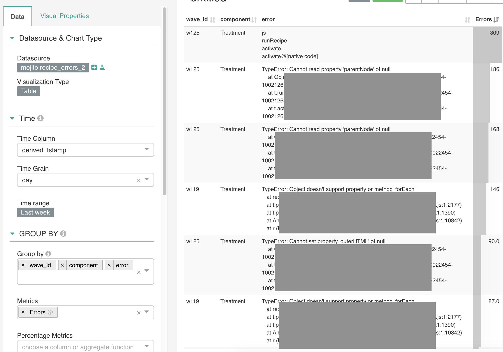

# Mojito Snowplow/Redshift data models

For measuring causality, we only count conversions taking place **after** a user is bucketed into a test. Tracking events before exposure to a treatment only confounds the results.

Mojito does this by cherry-picking two types of events:

1. **First exposures**: Each subject's first exposure to a treatment
2. **All conversions**: Every distinct conversion event a subject triggers

Using these two events, we can effectively attribute conversions back to the first exposure of each subject.

| Time  | Subject's events  | Event counted in reports? |
|---|---|---|---|
| 12:01  | Conversion | ❌ | 
| 12:02  | Exposure | ✅ First exposure | 
| 12:03  | Conversion | ✅ Converted | 
| 12:04  | Exposure | ❌ | 
| 12:05  | Conversion | ✅ Converted again *(if measuring multiple goal hits)* | 

Think "event sequencing" in GA's advanced segments... but with better assurances of when events arrived.

## Exposure tables

Exposure events occur when subjects are bucketed or exposed. We take the timestamp of each subjects' first exposure through base_exposures.sql, like so:

```{sql}
-- Exposures table
SELECT
	domain_userid AS subject,
	app_id as client_id,
	recipe as recipe_name,
	x.wave_id,
	-- Get the first exposure timestamp
	min(derived_tstamp) AS exposure_time
FROM atomic.events e
INNER JOIN atomic.io_mintmetrics_mojito_mojito_exposure_1 x
	ON e.event_id = x.root_id AND e.collector_tstamp = x.root_tstamp
WHERE e.event_name = 'mojito_exposure'
	AND e.event_version = '1-0-0'

	-- Handle cases where the unit is not set
	AND e.domain_userid IS NOT NULL

	-- Internal traffic & bot exclusion
	AND NOT (
	case 
		when app_id = 'mintmetrics' then user_ipaddress in (
		SELECT ip_address FROM mintmetrics.ip_exclusions UNION SELECT user_ipaddress FROM snowplow_intermediary.bot_ipaddress_exclusion_1
		)
	end
	)
GROUP BY 1, 2, 3, 4
```

Next, we filter duplicate exposures (which may be due to cookie churn or internal traffic reaching reports):

```
  -- Filter users who may be a part of both treatments
  dupes as (
    select subject, wave_id, client_id
    from exposures
    group by 1, 2, 3
    having count(recipe_name) = 1
  )

  select x.* 
  from exposures x
  inner join dupes d                  
    on x.subject = d.subject 
      and x.wave_id = d.wave_id 
      and x.client_id = d.client_id
  order by client_id, wave_id, exposure_time
```

We load conversions into different tables depending on the **test subject's unit of assignment**. At Mint Metrics we support:

 - **usercookie**: Snowplow's first-party user cookie (```domain_userid```), the default & recommended unit of assignment.
 - **userfingerprint**: A combination of the Snowplow Browser fingerprint (```user_fingerprint```) & user IP address (```user_ipaddress```), useful for passive cross-domain tracking


## Conversion tables

Then, from a table of conversion events, we grab the first "conversion" after exposure:

```{sql}
    SELECT
        domain_userid AS subject,
        -- This is the value for the goal
        CASE 
            WHEN event = 'struct' THEN
                se_category || ' ' || se_action
            WHEN event = 'page_view' THEN
                'page_view ' || page_urlpath
            WHEN event = 'transaction' THEN
                'purchase'
        END AS goal,

        -- This is used for revenue reporting
        tr_total AS revenue,
        
        -- Aggregate over the first event id (in case your Snowplow pipeline is generating duplicates)
        Min(derived_tstamp) AS conversion_time

    FROM
        mintmetrics.events
    WHERE
        domain_userid IS NOT NULL
        and event in ('page_view', 'struct', 'transaction')
    GROUP BY
        -- We group by the transaction ID or event ID to ensure we're not double-counting events
        1, 2, 3, nvl(tr_orderid, event_id)

    ORDER BY conversion_time
```

We deduplicate events by their transaction ID (if available) or by their Snowplow event ID.

This enables us to quickly join subjects' conversions onto their first initial exposures during analysis. 

## Error tracking & attribution

For reporting on errors, you'll need to build another table that should give you plenty of huicy context to find and fix your errors:

```{sql}
SELECT
	app_id as client_id,
	domain_userid as subject,
	wave_id,
	recipe_name as component,
	recipe_error as error,
	page_urlhost,
	page_urlpath,
	ua.os_family,
	ua.device_family,
	ua.useragent_family,
	ua.useragent_major,
	derived_tstamp
FROM atomic.events e
INNER JOIN atomic.io_mintmetrics_mojito_recipe_failure_1 f
	ON e.event_id = f.root_id
		and e.collector_tstamp = f.root_tstamp
		and e.event_name = 'recipe_failure'
LEFT JOIN atomic.com_snowplowanalytics_snowplow_ua_parser_context_1 ua
	ON f.root_id = ua.root_id 
		and f.root_tstamp = ua.root_tstamp
```

We use the User Agent Parser library in Snowplow's enrichments to classify devices' useragents. Page URLs, treatment (components) and error messages provide us with heaps of context for debugging.

And this table makes for useful Superset dashboards too:




## Adding data modelling steps to Snowplow SQL Runner

To update reports after each Snowplow Enrichment, we recommend using Snowplow's very own SQL Runner. You'll just need two steps to run, like so:

```{yaml}
# ...
steps:
  - name: Exclusion filters
    queries:
      - name: Bot exclusions
        file: bot_ip_exclusion.sql
  - name: Mojito base
    queries:
      - name: Mojito exposures
        file: mojito/base_exposures.sql
  - name: Mojito errors
    queries:
      - name: Errors
        file: mojito/recipe_errors_2.sql
  - name: Mojito conversions
    queries:
      - name: Mint Metrics
        file: mojito/conversions/mintmetrics.sql

```

# Get involved

We'll need help supporting other Snowplow Storage Targets, like Big Query, Snowflake and Azure's Data Lake product.

Feel free to reach out to us:

* [Open an issue on Github](https://github.com/mint-metrics/mojito-snowplow-storage/issues/new)
* [Mint Metrics' website](https://mintmetrics.io/)